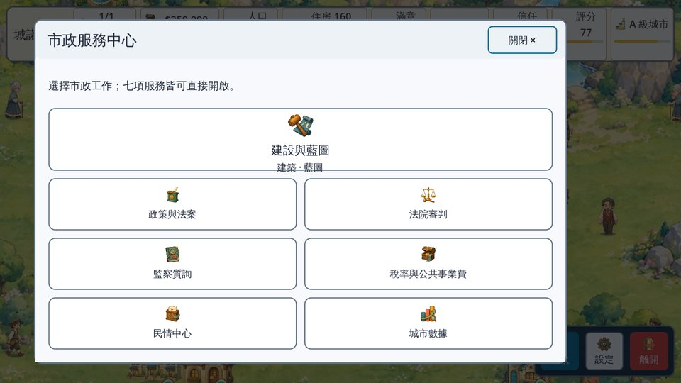
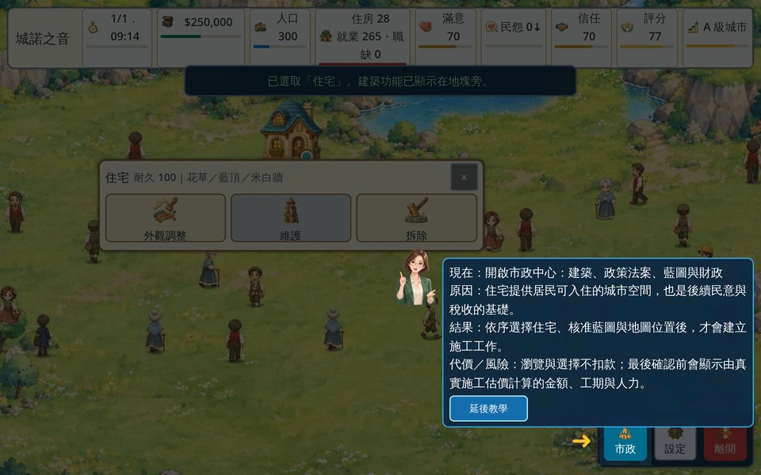

<div align="center">

# 城諾之音 CivicTale: Voice of Promise

**童話繪本風的城市治理模擬遊戲：玩家不只蓋城市，還要為每一個承諾、預算與權力選擇負責。**

[](https://github.com/xichengyu810067-lab/MayorSimulator/actions/workflows/godot-ci.yml)
[](VERSIONING.md)
[](https://godotengine.org/)
[](docs/qa/TEST_STRATEGY.md)
[](LICENSE.txt)


個人作品集專案｜資管系學生 × AI coding agent 協作開發｜專案代號 Mayor Simulator

</div>

## 30 秒看懂

| | |
| --- | --- |
| **想證明的能力** | 把模糊的點子拆成需求與驗收標準、設計測試、管理版本與發佈，並帶著 AI coding agent 把產品做出來。對應 QA／PM／SA／SW 的證據見[能力對照](#能力對照)。 |
| **怎麼做出來的** | 我擔任產品負責人與 QA：寫需求和驗收標準 → Codex 實作 → [97 項自動化測試](tests/assertion_matrix.json)與 [CI](.github/workflows/godot-ci.yml) 把關 → 我人工驗收 → 合併。詳見[開發方式](docs/how-it-was-built.md)。 |
| **為什麼做** | 想做一款「承諾會被檢驗」的治理遊戲，也想驗證：資管背景的人能不能用 AI 走完一次完整的產品週期。詳見 [PRD](docs/product/PRD.md)。 |
| **帶給我的改變** | 從「會寫功能」變成「會定義完成」；學會版本治理、風險分級，以及怎麼管住會「宣稱完成」的 AI。詳見[歷程與反思](docs/development/PROJECT_HISTORY.md)。 |

## 能力對照

| 職能 | 在這個專案做了什麼 | 證據 |
| --- | --- | --- |
| **QA** | 風險導向的測試策略、97 項隔離執行的自動化測試、強制終止存檔測試、P0–P3 缺陷分級 | [測試策略](docs/qa/TEST_STRATEGY.md)・[已知問題](docs/release/KNOWN_ISSUES_0.1.0-alpha.3.md)・[CI 紀錄](https://github.com/xichengyu810067-lab/MayorSimulator/actions) |
| **PM** | 一頁 PRD、MVP 範圍與刻意不做的事、SemVer 版本治理、發佈說明、品牌撞名稽核 | [PRD](docs/product/PRD.md)・[版本規則](VERSIONING.md)・[發佈說明](docs/release/RELEASE_NOTES_0.1.0-alpha.3.md)・[撞名稽核](docs/marketing/BRAND_NAME_AND_PROMOTION_COLLISION_AUDIT_2026-08-03.md) |
| **SA** | 系統脈絡、模組關係、指令與事件流、存檔資料模型與版本遷移 | [系統架構](docs/architecture.md)・[存檔版本表](data/save_schema_authority_registry.json) |
| **SW** | GDScript 遊戲開發、原子存檔、Windows／Linux CI/CD、重構與技術債管理 | [存檔實作](scripts/core/save_service.gd)・[CI 設定](.github/workflows/godot-ci.yml)・[技術債清單](docs/development/TECH_DEBT.md) |

## 遊戲特色

<table>
  <tr>
    <td width="50%"><br><sub>開始畫面：繁中、簡中、英、日、韓五種語言</sub></td>
    <td width="50%"><br><sub>市政服務中心：建設、政策、法院、監察、財政、民情、數據</sub></td>
  </tr>
  <tr>
    <td><br><sub>政策與法案：由 30 席下議院審議表決</sub></td>
    <td><br><sub>新手引導：每一步都說明原因、結果與代價</sub></td>
  </tr>
</table>

- **城市建設**：10×10 地圖、29 種建築；整地、核准藍圖、派工施工。地形、建築占地與居民路徑共用同一份地形資料。
- **財政與月結算**：調整稅率、公共事業費與服務費，每月結算收支並產生城市報告。
- **治理與制衡**：政策與法案、下議院表決、法院審判、監察質詢。
- **居民與交通**：會尋路、避障的居民；道路、捷運、鐵路、航空路網與車輛。
- **可靠存檔**：先寫暫存檔、驗證、再輪替備份；程式被強制關閉也能復原（[原理](docs/architecture.md#5-原子存檔程式被強制關掉也不壞檔)）。

## 快速開始

### 環境需求

| 項目 | 版本 | 用途 |
| --- | --- | --- |
| [Godot Engine](https://godotengine.org/download/archive/4.7-stable/) | 4.7 stable（Standard 版，不是 .NET 版） | 執行與編輯遊戲 |
| [PowerShell](https://learn.microsoft.com/powershell/scripting/install/installing-powershell) | 7.4 以上 | 執行自動化測試（選用） |
| Git | 任一版本 | 下載原始碼（約 520 MB） |

支援 Windows 10／11 與 Linux。macOS 可以用 Godot 執行原始碼，但沒有匯出成品。

### 安裝與執行

1. 下載並解壓縮 Godot 4.7。
2. 下載原始碼：

   ```bash
   git clone https://github.com/xichengyu810067-lab/MayorSimulator.git
   cd MayorSimulator
   ```

3. 啟動遊戲（第一次會先匯入素材，需要幾分鐘）：

   ```bash
   godot --path .
   ```

   - Windows 請把 `godot` 換成 `Godot_v4.7-stable_win64.exe` 的完整路徑。
   - 也可以開啟 Godot 編輯器 →「匯入」→ 選擇 `project.godot` → 按 <kbd>F5</kbd>。
   - 顯示卡不支援 Vulkan 時，加上 `--rendering-method gl_compatibility --rendering-driver opengl3`。

> `sdk/` 是私有子模組，**玩遊戲和跑測試都不需要它**，clone 時不用處理。

### 執行自動化測試

```bash
# 全部 97 項，每一項使用獨立的使用者資料夾（約 25–30 分鐘）
pwsh tools/run_assertion_matrix.ps1 -GodotExe <Godot 執行檔路徑> -OutputRoot .tmp/assertion-matrix/run-01

# 只跑一項
pwsh tools/run_assertion_matrix.ps1 -GodotExe <Godot 執行檔路徑> -TestId start_screen_flow -OutputRoot .tmp/assertion-matrix/run-02
```

設定環境變數 `GODOT_EXE` 後可以省略 `-GodotExe`。結果寫在 `<OutputRoot>/SUMMARY.md` 與 `summary.json`。測試範圍與判定標準見[測試策略](docs/qa/TEST_STRATEGY.md)。

### 匯出與發佈

匯出 Windows／Linux 成品、封裝與產生發佈證據的步驟，見[開發、測試與發佈流程](docs/release/RELEASE_PROCESS.md)。

## 專案結構

```text
MayorSimulator/
├─ scenes/    主場景
├─ scripts/   遊戲程式：app（協調）、core（模擬核心與存檔）、systems（建設、治理、人口、交通）、world（地圖與角色）
├─ systems/   下議院、司法與監察（各自有資料與測試的獨立模組）
├─ ui/        介面面板與元件
├─ data/      建築與政策目錄、存檔版本表、五語系翻譯
├─ assets/    圖片、音訊、影片
├─ tests/     單元、整合與 UI 測試，以及測試清單 assertion_matrix.json
├─ tools/     測試執行器、封裝、素材與翻譯工具
└─ docs/      產品、架構、測試與發佈文件（文件導覽：docs/README.md）
```

**技術棧**：Godot 4.7、GDScript、PowerShell 7（測試與封裝）、Python（素材工具）、GitHub Actions（Windows + Ubuntu）。架構說明見[系統架構](docs/architecture.md)。

## 已知限制

- 這是**內部 Alpha**，不是公開發行版；部分美術素材的散布權利尚未確認（[公開發佈阻塞](docs/release/PUBLIC_RELEASE_BLOCKERS.md)）。
- 五種語言尚未完成人工驗收，英文介面在部分欄位會斷字（[已知問題](docs/release/KNOWN_ISSUES_0.1.0-alpha.3.md)）。
- 執行檔未簽章；程式碼的結構問題與改善計畫列在[技術債清單](docs/development/TECH_DEBT.md)。

## 授權

保留所有權利。本儲存庫公開供作品集審閱，未授與複製、修改或散布的權利，詳見 [LICENSE.txt](LICENSE.txt)。Godot Engine 依 MIT 授權使用，見 [THIRD_PARTY_NOTICES.md](THIRD_PARTY_NOTICES.md)。

## English summary

*CivicTale: Voice of Promise* is a storybook-style city governance simulator built with Godot 4.7. I acted as product owner and QA lead and directed an AI coding agent (OpenAI Codex) to implement it: I wrote the requirements and acceptance criteria, and 97 isolated automated tests plus GitHub Actions gate every merge. Start with [how it was built](docs/how-it-was-built.md), the [architecture](docs/architecture.md) and the [test strategy](docs/qa/TEST_STRATEGY.md) (documents are in Traditional Chinese).

---

作者：[@xichengyu810067-lab](https://github.com/xichengyu810067-lab)
