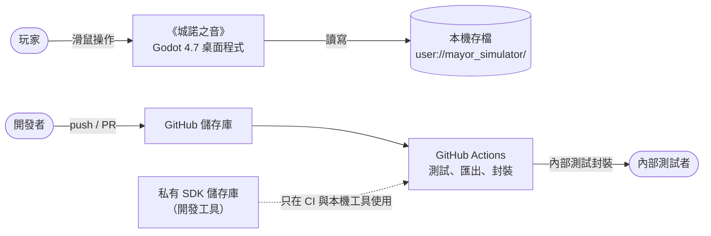
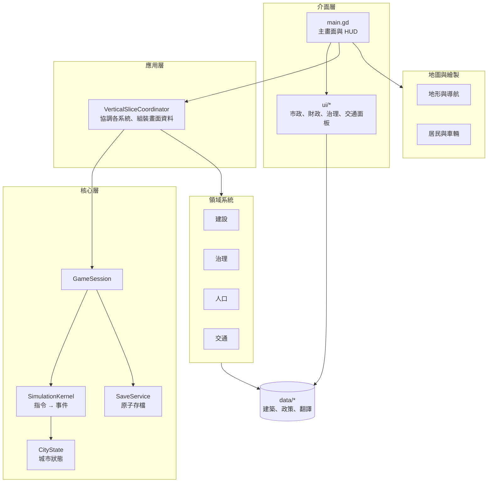
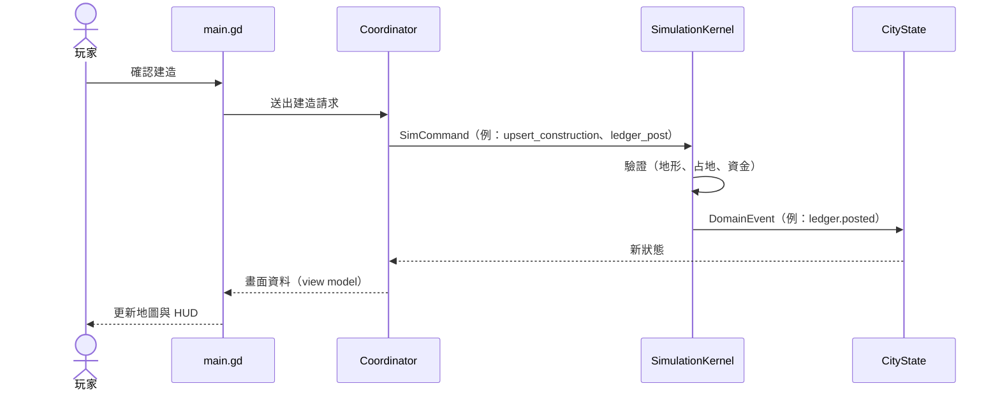
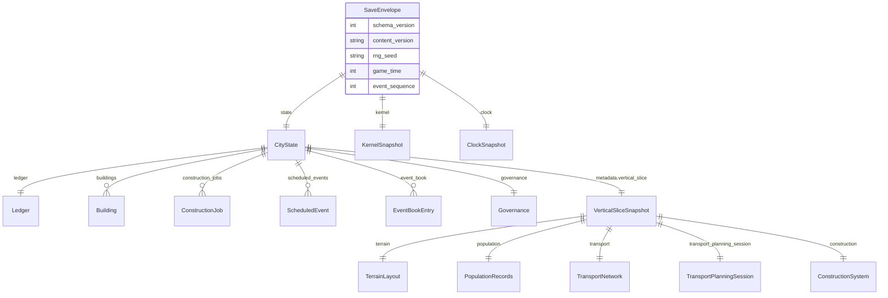
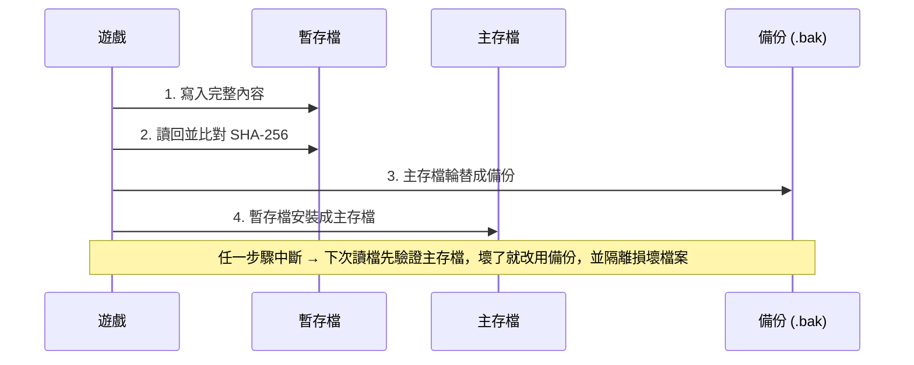

# 系統架構

這份文件用 5 張圖說明遊戲怎麼組成、資料怎麼流動、存檔怎麼保護。圖中的名稱都對應到實際檔案，點連結可以直接看程式碼。

## 1. 系統脈絡

遊戲在執行時**沒有**網路、帳號或後端服務；所有資料都在玩家本機（[隱私說明](../PRIVACY_NOTICE.md)）。

## 2. 模組關係

| 層 | 主要檔案 |
| --- | --- |
| 介面 | [`scripts/app/main.gd`](../scripts/app/main.gd)、[`ui/`](../ui) |
| 應用 | [`scripts/app/vertical_slice_coordinator.gd`](../scripts/app/vertical_slice_coordinator.gd) |
| 核心 | [`game_session.gd`](../scripts/core/game_session.gd)、[`simulation_kernel.gd`](../scripts/core/simulation_kernel.gd)、[`city_state.gd`](../scripts/core/city_state.gd)、[`save_service.gd`](../scripts/core/save_service.gd) |
| 領域系統 | [`scripts/systems/`](../scripts/systems)、[`systems/governance/`](../systems/governance)（下議院、司法與監察） |
| 地圖與繪製 | [`scripts/world/`](../scripts/world) |
| 資料 | [`data/catalogs/`](../data/catalogs)、[`data/databases/`](../data/databases)、[`data/localization/`](../data/localization) |

## 3. 一次操作怎麼改變城市

核心狀態只透過「指令 → 事件」改變：介面送出指令，`SimulationKernel` 驗證後產生領域事件，再套用到 `CityState`。同一個亂數種子會得到同一個結果，所以測試可以重現。

指令種類見 [`simulation_kernel.gd`](../scripts/core/simulation_kernel.gd)（推進日期、記帳、建築、施工、居民、排程事件、治理等）。例外：部分城市指標仍由 `main.gd` 直接寫入，列在[技術債](development/TECH_DEBT.md)。

## 4. 存檔資料模型

每個區塊各自有版本號，讀檔時會逐版遷移；比目前程式更新的版本會被拒絕。版本與可讀範圍集中在 [`data/save_schema_authority_registry.json`](../data/save_schema_authority_registry.json)：

| 區塊 | 目前版本 | 可讀版本 |
| --- | --- | --- |
| 存檔外層（SaveEnvelope） | 1 | 1 |
| 城市狀態（CityState） | 2 | 1–2 |
| 遊戲主體（vertical_slice） | 12 | 4–12 |
| 地形配置 | 4 | 見登錄表 |
| 人口、居民紀錄、交通網路、交通規劃 | 2 | 見登錄表 |

## 5. 原子存檔：程式被強制關掉也不壞檔

實作在 [`save_service.gd`](../scripts/core/save_service.gd)，驗收方式是在 5 個寫檔階段用作業系統強制終止程序，再重啟檢查能否復原（[`run_save_os_kill_qa.ps1`](../tools/run_save_os_kill_qa.ps1)）。

## 6. 目錄對照

| 目錄 | 內容 |
| --- | --- |
| `scenes/` | 主場景 `Main.tscn` |
| `scripts/` | 應用、核心、領域系統、地圖繪製 |
| `systems/governance/` | 下議院、司法與監察（各自有資料與測試的獨立模組） |
| `ui/` | 面板、元件、教學、主題 |
| `data/` | 建築與政策目錄、資料結構、治理資料、翻譯 |
| `assets/` | 圖片、音訊、影片 |
| `tests/` | 單元、整合、UI、QA 專項、人工驗收腳本 |
| `tools/` | 測試執行器、封裝、素材與翻譯工具 |
| `docs/` | 文件（[文件導覽](README.md)） |
