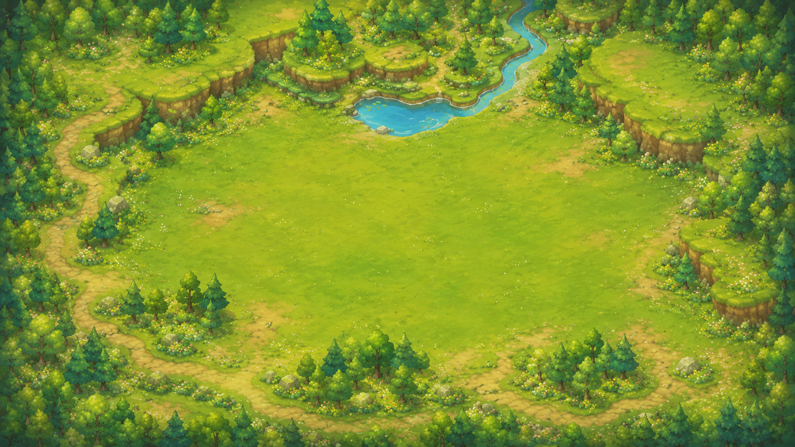
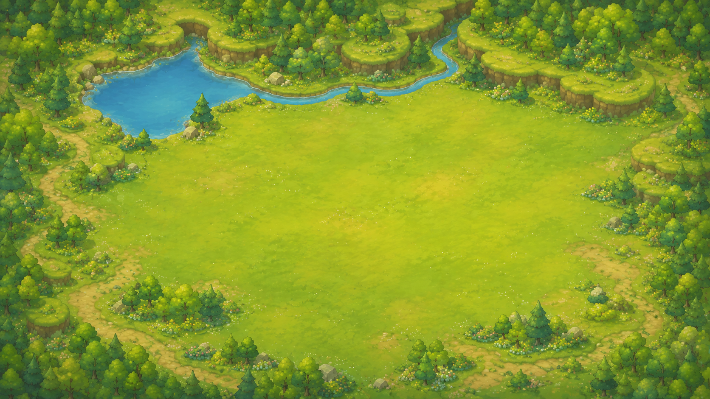
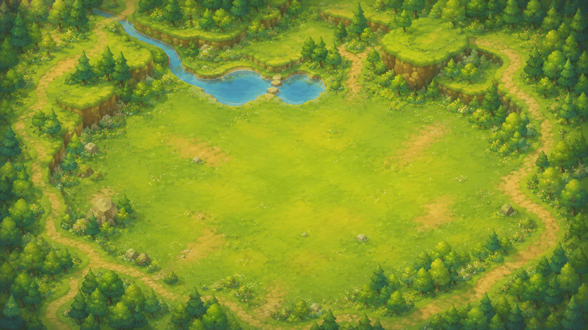
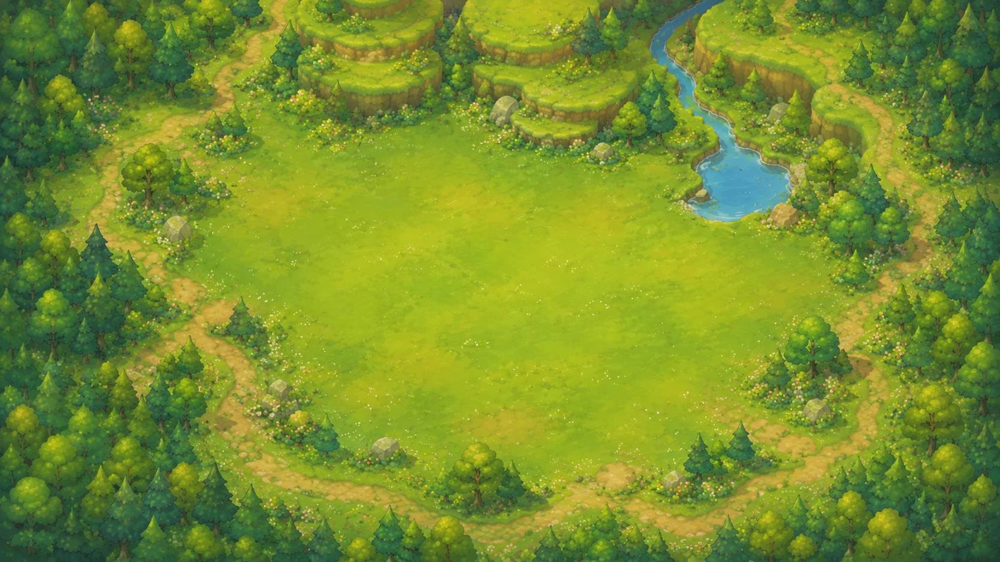
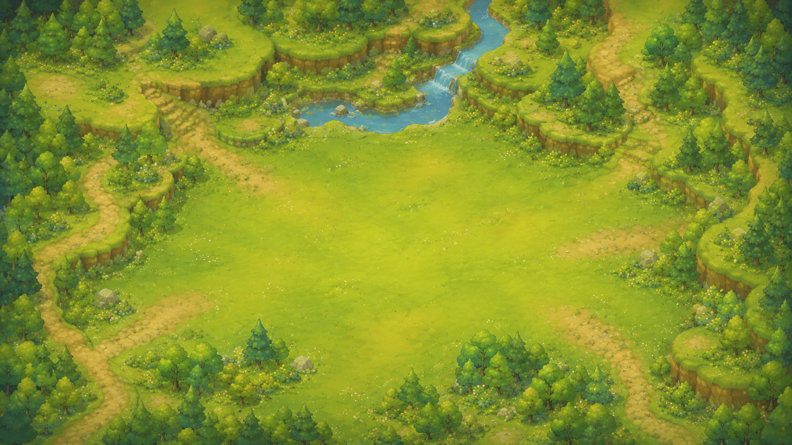

# Mayor Simulator 背景重製指引（只專注背景）

> 本文件只處理 **背景**。  
> 其餘與背景無關的內容一律 **暫停修改**。

---

## 1. 本次任務的唯一目標

請把目前遊戲的背景重製成：

- **正式遊戲畫面等級的背景**
- **可愛、童話、手繪、柔和明亮** 的美術風格
- 有 **完整場景感**，不是空白底色
- 適合作為 **城市建造 / 市長模擬器** 的主遊戲場景背景

你不是要重做整個遊戲，也不是要動 UI、建築、NPC、功能。

你要做的是：

> **只重做背景底圖與背景場景層，讓現有遊戲主畫面看起來像正式發行的童話風建造遊戲。**

---

## 2. 嚴格限制：這次只能改什麼

### 允許修改

- 地圖後方的背景底圖
- 地面整體美術表現
- 森林邊界
- 草地、花叢、石頭、灌木
- 小丘陵、土坡、層次化草地台地
- 池塘、小河、溪流
- 背景道路 / 小徑（非功能性背景表現）
- 遠景與周邊自然場景

### 禁止修改

- UI
- 按鈕
- 建築外觀
- 建築位置
- NPC
- 尋路
- 碰撞
- 格子系統
- 建造系統
- 數值
- 功能邏輯
- 任何非背景內容

如果某個改動會連帶影響背景以外的內容，**先不要做**。

---

## 3. 你真正要理解的核心

請把背景理解成：

> 一個 **為建造遊戲服務的童話風舞台**。

也就是說：

- 背景要漂亮
- 背景要完整
- 背景要有場景感
- 但背景不能搶走主遊戲區
- 中央要留出大面積乾淨草地，方便未來放建築

---

## 4. 你應該學什麼

### A. 大面積中央空地

中央要保留一塊大面積、乾淨、可讀性高的草地空間。  
這塊區域是未來放建築的主場，不要被樹林、石頭、道路、水域切碎。

### B. 正式遊戲場景感

背景不能只是單色或貼圖底色。  
要有森林邊界、地形高低、花叢、石頭、小徑、水域等元素，讓畫面看起來像完整的遊戲世界。

### C. 童話手繪風

整體要柔和、明亮、圓潤、可愛。  
草地、樹木、溪流、池塘都要偏手繪插畫感，不要偏寫實。

### D. 地形層次

可以有草地台地、低矮懸崖、緩坡、土坡，形成場景深度。  
但不要做得過於崎嶇，避免喧賓奪主。

### E. 自然元素環繞中央空地

樹林主要集中在邊界。  
池塘、溪流、小徑可以放在邊角或上方，作為背景構圖點綴。

---

## 5. 你不該學什麼

### 不要做成純平面地圖插畫

不是世界地圖，不是羊皮紙地圖。  
這是遊戲主畫面的背景。

### 不要做成寫實廢土或工業風

不要髒灰、鏽蝕、末日、工業基地感。  
要童話、療癒、清新。

### 不要讓中央空地太小

如果背景細節太多，導致中央可用區域被壓縮，方向就錯了。

### 不要改到背景以外的內容

本次任務不是 UI 重製，也不是建築重製。

---

## 6. 參考圖片

以下五張圖片是背景方向參考。  
請學習它們共同的畫面語言：

- 大面積中央草地
- 周邊森林包圍
- 童話手繪風
- 柔和明亮綠色系
- 小溪、池塘、花叢、石頭、土路作為背景點綴
- 遊戲主畫面背景感，而不是單純插畫地圖

---

### 圖 1：中央空地清楚、周邊自然環繞

檔案：`assets/images/reference/background-style/background_reference_01.png`

重點：

- 中央有很大、很乾淨的空地
- 周邊樹林與小徑把舞台框出來
- 上方的池塘與溪流很適合作為背景點綴

---

### 圖 2：溪流與小瀑布方向

檔案：`assets/images/reference/background-style/background_reference_02.png`

重點：

- 有更明顯的溪流與小瀑布
- 背景層次豐富，但中央仍保留乾淨草地
- 可作為「稍微更有高低差」的背景方向

---

### 圖 3：雙池塘與周邊小徑方向

檔案：`assets/images/reference/background-style/background_reference_03.png`

重點：

- 兩個小池塘與溪流形成上方視覺焦點
- 道路主要在周邊，不切碎中央區域
- 適合做成溫和、穩定、易讀的背景

---

### 圖 4：大湖面與開闊中央方向

檔案：`assets/images/reference/background-style/background_reference_04.png`

重點：

- 上方大湖面與蜿蜒溪流有更鮮明的景觀感
- 中央空地很大，適合當主建造區
- 可作為「水域稍多」的方向參考

---

### 圖 5：平衡構圖方向

檔案：`assets/images/reference/background-style/background_reference_05.png`

重點：

- 池塘位於上方中間，構圖平衡
- 周邊樹林和小徑清楚包圍主要遊戲區
- 非常適合做成可讀性高的背景底圖

---

## 7. 實作準則

### 背景設計準則

- 中央 60% 左右區域應維持為可讀性高的開闊草地
- 背景細節主要放在周邊與上方
- 草地不能單調，要有輕微色差、花叢、少量裸土
- 樹木與灌木主要作為邊界框景
- 水域不要佔太大，但要能成為畫面亮點
- 小徑應該是背景構圖元素，不要切碎主遊戲區
- 整體風格要一致，不要一半手繪一半寫實

### 畫面氛圍準則

- 明亮
- 清新
- 可愛
- 溫暖
- 童話感
- 適合休閒建造遊戲

---

## 8. 具體錯誤示例，請避免

### 錯誤 1

把整張背景做成很多細節、很多樹，結果中央可用空地很小。

### 錯誤 2

只是把現在背景塗成綠色，沒有真正的場景層次。

### 錯誤 3

把背景畫成地圖插畫，而不是遊戲主場景。

### 錯誤 4

順手去改建築、UI、NPC。

### 錯誤 5

背景風格偏寫實、偏末日、偏工業。

---

## 9. 實作流程建議

1. 先暫停所有非背景工作。
2. 只針對背景場景層建立新版本。
3. 先做 1 個最終背景版本，不要同時亂改其他系統。
4. 實際進遊戲查看整體畫面。
5. 確認建築 / UI / NPC 都沒被動到。
6. 只在背景層反覆調整，直到畫面呈現接近上述參考。

---

## 10. 最終交付要求

完成後請提供：

- 修改前截圖
- 修改後截圖
- 簡短說明：背景具體改了哪些地方
- 確認本次只改背景，其他內容未動

---

## 一句話總結

> **只重做背景，把目前畫面後方改成「童話手繪風、正式遊戲感、中央大草地、周邊森林與溪流環繞」的背景；其他與背景無關的東西全部先不要動。**
