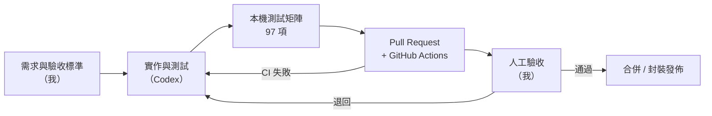

# 這個專案是怎麼做出來的

**一句話：我負責定義「要做什麼、做到什麼程度才算完成」，AI coding agent 負責寫程式，自動化測試與 CI 負責擋住「AI 說做完了、其實沒做完」的情況。**

## 分工

| 角色 | 誰 | 負責 | 看證據 |
| --- | --- | --- | --- |
| 產品負責人（PO） | 我 | 拆需求、排優先順序、寫驗收標準、決定延後什麼 | [美術規格與驗收標準](../ux/specifications/美編規格書.md)、[背景重製指引](design/background_reference_guide.md)、[延期待辦](development/deferred_todos.md) |
| QA 負責人 | 我 | 人工驗收、決定測試範圍、判定能不能發佈 | [測試策略](qa/TEST_STRATEGY.md)、[已知問題 P0–P3](release/KNOWN_ISSUES_0.1.0-alpha.3.md)、[Bug 回報範本](release/BUG_REPORT_TEMPLATE.md) |
| 實作 | OpenAI Codex（主要），影像生成工具（部分美術） | 寫程式與測試、執行測試、提交 PR | [Pull requests](https://github.com/xichengyu810067-lab/MayorSimulator/pulls?q=is%3Apr) |
| 作品集審查與重構 | Claude Code（2026-10） | 架構審查、清理、文件與重構 | [專案歷程](development/PROJECT_HISTORY.md) |

AI 產生的 commit 從 2026-10 起會帶 `Co-Authored-By` 標註；更早的 commit 沒有標註，分工以本頁為準。

## 一個功能怎麼從想法變成合併

## 我怎麼管住 AI

1. **先寫驗收標準，再讓 AI 動手。** 例如美術改版要求「每次修改後都必須重新啟動或刷新畫面，檢查截圖效果」（[美編規格書](../ux/specifications/美編規格書.md)）。
2. **用一份測試清單當唯一事實。** [`tests/assertion_matrix.json`](../tests/assertion_matrix.json) 列出 97 項測試，本機與 [CI](../.github/workflows/godot-ci.yml) 跑的是同一份。
3. **把專案規則寫成 AI 會讀的工作規範。** [`skills/mayor-simulator-sdk`](../skills/mayor-simulator-sdk/SKILL.md) 規定例如：存檔格式變更必須附遷移與測試、證據不能沿用舊的執行結果。
4. **不接受「AI 說完成」。** 發佈前要有單次、完整的驗收紀錄（[發佈流程](release/RELEASE_PROCESS.md)）。

## 規模

- 22 個主對話、131 個子代理對話、116 則主要指令，約 30.7 萬字（截至 2026-08-01，[統計](../skills/mayor-simulator-sdk/references/chat-derived-workflows.md)）。
- 約 5.3 萬行遊戲程式（GDScript）、3.9 萬行測試、97 項自動化測試。
- 2026-08-01 起納入 Git：9 個 PR、40 多次 CI 執行。

## 做得不好的地方

AI 很擅長「加東西」，不擅長「刪東西」與「保持一致」。這個專案因此留下了：互相矛盾的文件、9,700 行的 `main.gd`、一次 CI 失敗仍被合併的 PR，以及兩個起點的 Git 歷史。原因與改善方式記在[專案歷程與反思](development/PROJECT_HISTORY.md)和[技術債清單](development/TECH_DEBT.md)。
