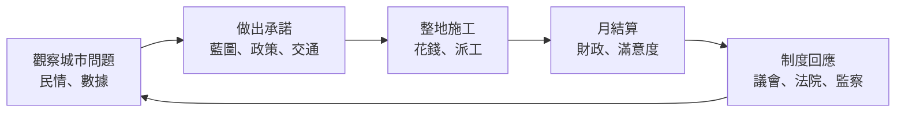

# 產品需求（一頁版）— 《城諾之音》CivicTale: Voice of Promise

| 項目 | 內容 |
| --- | --- |
| 版本 | 0.1.0-alpha.3（內部 Alpha，[版本規則](../../VERSIONING.md)） |
| 平台 | Windows x64、Linux x86_64（Godot 4.7） |
| 負責人 | 專案擁有者（PO／QA），實作由 AI coding agent 協作完成（[開發方式](../how-it-was-built.md)） |

## 1. 要解決的問題

多數城市建造遊戲問的是「你能蓋多大？」。這個遊戲想問：**你答應了誰、花了多少錢、制度允不允許，而結果真的改善居民生活了嗎？** 承諾、預算和權力選擇都要被居民、議會、法院與監察檢驗。

## 2. 目標使用者

1. 喜歡城市建造與系統因果的玩家。
2. 對政策、議會與制度取捨有興趣的玩家。
3. 喜歡療癒的繪本畫風，但想要比裝飾建造更有深度的玩家。

## 3. 核心循環

## 4. MVP 範圍（0.1.0-alpha.3 已完成）

| 模組 | 內容 | 驗收依據 |
| --- | --- | --- |
| 城市建設 | 10×10 地圖、29 種建築、整地、藍圖核准、派工施工 | [建築足跡測試](../../tests/integration/building_footprint_authority_test.gd) |
| 財政 | 稅率、公共事業費、服務費、月結算與報告 | [財政草稿流程測試](../../tests/ui/fiscal_draft_workflow_test.gd)、[月報表期間測試](../../tests/integration/monthly_dashboard_period_semantics_test.gd) |
| 治理 | 政策與法案、30 席下議院表決、法院審判、監察聽證 | [下議院](../systems/governance/lower_council.md)、[司法與監察](../systems/governance/justice_oversight.md) |
| 居民與交通 | 會尋路、避障的居民；道路、捷運、鐵路、航空路網與車輛 | [交通網路測試](../../tests/unit/systems/transport_network_system_test.gd) |
| 體驗 | 開場動畫、新手教學、5 種語言、深色模式、音量設定 | [多解析度 UI 驗收](../../tests/ui/multi_resolution_ui_acceptance_test.gd) |
| 可靠性 | 原子存檔、備份復原、不可信存檔輸入上限、舊存檔遷移 | [存檔復原測試](../../tests/unit/core/save_recovery_self_test.gd) |

## 5. 刻意不做（Non-goals）

- 不做大型城市、逐車交通模擬或 20 萬人口實機能力（已量測，未達標，列為 [P3](../release/KNOWN_ISSUES_0.1.0-alpha.3.md)）。
- 不重製或模仿既有商業城市建造遊戲（[原創性契約](../design/city_simulation_originality_contract.md)）。
- 不做 AI 自由文字立法（[延期到 Beta 之後](../development/deferred_todos.md)）。
- 素材權利確認前不公開發佈（[公開發佈阻塞](../release/PUBLIC_RELEASE_BLOCKERS.md)）。

## 6. 成功指標（建議，尚未實測）

| 指標 | 目標 | 量測方式 |
| --- | --- | --- |
| 新手教學完成率 | ≥ 70% | 內部測試者回報 + 教學進度存檔 |
| 首次遊玩 30 分鐘內完成第一次月結算 | ≥ 80% 測試者 | 測試者觀察紀錄 |
| 存檔損毀回報 | 0 件 | [Bug 回報範本](../release/BUG_REPORT_TEMPLATE.md) |
| 每個版本的 P0／P1 缺陷 | 發佈前 0 個未處理 | [已知問題](../release/KNOWN_ISSUES_0.1.0-alpha.3.md) |

## 7. 里程碑

Alpha（目前）→ Beta（五語系人工驗收、素材權利釐清）→ Release Candidate → Release。發佈通道與版本號規則見 [VERSIONING.md](../../VERSIONING.md)。
